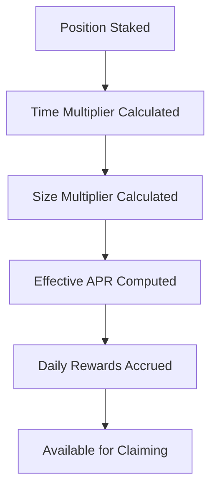

# KILT Liquidity Staker - Smart Contract Deployment Guide

## Overview

This guide provides step-by-step instructions for deploying and configuring the KILT Liquidity Staker smart contract system on Base network. The system implements a comprehensive reward distribution mechanism for Uniswap V3 liquidity providers.

## Smart Contract Architecture

### Core Contract: KiltStaker.sol

**Features:**
- Uniswap V3 NFT position validation
- Time-based reward multipliers (1x to 2x over 30 days)
- Size-based reward multipliers (1x to 1.5x for large positions)
- Automatic reward accrual and distribution
- Gas-optimized calculations
- ReentrancyGuard and access control protection

**Key Functions:**
- `stakePosition(uint256 tokenId, uint256 liquidity)` - Stake NFT position
- `unstakePosition(uint256 tokenId)` - Unstake and claim rewards
- `claimRewards()` - Claim all pending rewards
- `calculateRewards(uint256 tokenId)` - View function for reward calculation

## Pre-Deployment Requirements

### 1. Environment Setup

```bash
# Install dependencies
npm install --save-dev hardhat @nomiclabs/hardhat-ethers ethers
npm install @openzeppelin/contracts

# Create hardhat.config.js
```

### 2. Network Configuration

**Base Network Details:**
- Chain ID: 8453
- RPC URL: https://mainnet.base.org
- Block Explorer: https://basescan.org

**Required Addresses:**
- KILT Token: `0x5d0dd05bb095fdd6af4865a1adf97c39c85ad2d8`
- WETH: `0x4200000000000000000000000000000000000006`
- Uniswap V3 NFT Manager: `0x03a520b32C04BF3bEEf7BF5d92bf15F25de9a9E5`

### 3. KILT Treasury Allocation

**Program Parameters:**
- Total KILT Supply: 290,560,000 tokens
- Treasury Allocation: 1% (2,905,600 KILT)
- Base APR: 47.2%
- Program Duration: Configurable (suggested 30-90 days)

## Deployment Steps

### Step 1: Contract Compilation

```bash
# Compile the contract
npx hardhat compile

# Verify compilation
ls artifacts/contracts/KiltStaker.sol/
```

### Step 2: Deployment Script

```javascript
// scripts/deploy.js
async function main() {
  const [deployer] = await ethers.getSigners();
  
  console.log("Deploying contracts with account:", deployer.address);
  console.log("Account balance:", (await deployer.getBalance()).toString());

  // Deploy KiltStaker
  const KiltStaker = await ethers.getContractFactory("KiltStaker");
  const kiltStaker = await KiltStaker.deploy();
  
  await kiltStaker.deployed();
  
  console.log("KiltStaker deployed to:", kiltStaker.address);
  
  // Start the program
  const tx = await kiltStaker.startProgram();
  await tx.wait();
  
  console.log("Liquidity mining program started");
}
```

### Step 3: Execute Deployment

```bash
# Deploy to Base network
npx hardhat run scripts/deploy.js --network base

# Verify contract on Basescan
npx hardhat verify --network base <CONTRACT_ADDRESS>
```

### Step 4: Frontend Integration

Update the contract address in the frontend:

```typescript
// client/src/lib/smart-contracts.ts
export const KILT_STAKER_ADDRESS = '<DEPLOYED_CONTRACT_ADDRESS>';
```

## Post-Deployment Configuration

### 1. Program Initialization

```solidity
// Start the liquidity mining program
function startProgram() external onlyOwner

// Set program parameters (if needed)
function setBaseAPR(uint256 newAPR) external onlyOwner
```

### 2. KILT Token Funding

Transfer KILT tokens to the contract for reward distribution:

```javascript
// Fund the contract with KILT tokens
const kiltToken = await ethers.getContractAt("IERC20", KILT_TOKEN_ADDRESS);
await kiltToken.transfer(contractAddress, rewardAmount);
```

### 3. Security Verification

**Pre-launch Checklist:**
- [ ] Contract verified on Basescan
- [ ] Owner permissions configured correctly
- [ ] KILT token funding confirmed
- [ ] Program parameters validated
- [ ] Emergency functions tested
- [ ] Frontend integration working

## Reward Distribution Mechanism

### Mathematical Model

**Base Calculation:**
```solidity
dailyRewards = (liquidity * effectiveAPR) / (365 * 10000)
```

**Time Multiplier (1x to 2x):**
```solidity
timeMultiplier = 1 + min(daysStaked / 30, 1)
```

**Size Multiplier (1x to 1.5x):**
```solidity
sizeMultiplier = 1 + min(liquidityValue / 100000, 0.5)
```

**Effective APR:**
```solidity
effectiveAPR = baseAPR * timeMultiplier * sizeMultiplier
```

### Gas Optimization

The contract implements several gas optimization techniques:

1. **Packed Structs:** Efficient storage layout
2. **Batch Operations:** Multiple position updates in single transaction
3. **View Functions:** Off-chain calculation verification
4. **Event Emissions:** Minimal on-chain storage

## User Flow

### 1. Position Staking

```mermaid
graph TD
    A[User has Uniswap V3 NFT] --> B[Approve NFT to Contract]
    B --> C[Call stakePosition()]
    C --> D[Contract validates KILT/ETH position]
    D --> E[Position recorded, rewards start accruing]
```

### 2. Reward Calculation



### 3. Reward Claiming

```mermaid
graph TD
    A[User calls claimRewards()] --> B[Update all positions]
    B --> C[Calculate total pending]
    C --> D[Transfer KILT tokens]
    D --> E[Reset claim timestamps]
```

## Monitoring and Analytics

### Key Metrics to Track

1. **Program Health:**
   - Total positions staked
   - Total rewards distributed
   - Program time remaining
   - Treasury balance

2. **User Engagement:**
   - Active stakers
   - Average position size
   - Staking duration distribution
   - Claim frequency

3. **Economic Metrics:**
   - Effective APR distribution
   - Multiplier utilization
   - Reward distribution rate
   - Pool TVL impact

### Dashboard Implementation

The frontend includes real-time monitoring:

```typescript
// Automatic updates every 30 seconds
const { data: programStats } = useQuery({
  queryKey: ['program-stats'],
  queryFn: () => kiltStakerService.getProgramStats(),
  refetchInterval: 30000
});
```

## Security Considerations

### Smart Contract Security

1. **ReentrancyGuard:** Prevents reentrancy attacks
2. **Access Control:** Owner-only administrative functions
3. **Input Validation:** Comprehensive parameter checking
4. **Safe Transfers:** OpenZeppelin SafeERC20 usage
5. **Emergency Controls:** Circuit breakers and pause functionality

### Operational Security

1. **Multi-sig Wallet:** Use for contract ownership
2. **Timelock Contract:** For critical parameter changes
3. **Monitoring:** Real-time alerts for unusual activity
4. **Backup Plans:** Emergency withdrawal procedures

## Troubleshooting

### Common Issues

1. **Transaction Failures:**
   - Check gas limits
   - Verify contract approval
   - Confirm network connection

2. **Reward Calculation Errors:**
   - Validate position ownership
   - Check staking duration
   - Verify multiplier calculations

3. **Frontend Integration:**
   - Update contract addresses
   - Check ABI compatibility
   - Verify network configuration

### Support Resources

- **Base Network Documentation:** https://docs.base.org
- **Uniswap V3 Integration:** https://docs.uniswap.org/concepts/protocol/integration
- **OpenZeppelin Contracts:** https://docs.openzeppelin.com/contracts

## Conclusion

The KILT Liquidity Staker smart contract provides a robust, secure, and efficient mechanism for incentivizing liquidity provision in the KILT/ETH Uniswap V3 pool. The system's time and size-based multipliers create strong incentives for long-term, high-value liquidity provision while maintaining fairness and transparency through blockchain verification.

After deployment, the system will automatically handle reward calculations, distribution, and position management, providing users with a seamless experience while maintaining the security and decentralization principles of DeFi.